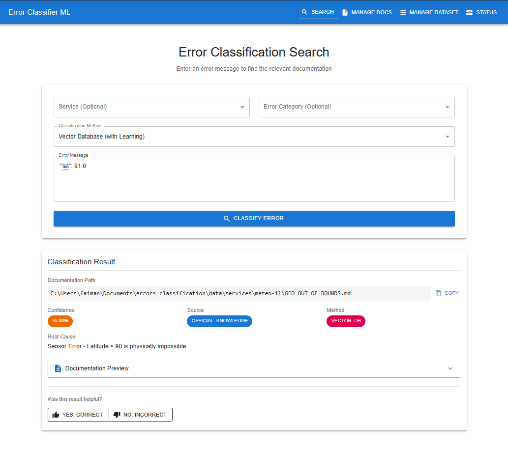

# Error Classification System

A full-stack ML-based system that automatically classifies error logs and maps them to their corresponding documentation files using Natural Language Processing. Features three advanced classification methods, a Flask REST API, and a modern React web interface.



## Architecture

- **Backend**: Python Flask API with ML models (Vector DB, Semantic Search, Random Forest)
- **Frontend**: React + Vite + Material-UI + TanStack Router/Query
- **Database**: ChromaDB for persistent vector storage with learning capability
- **Deployment**: Docker + Docker Compose for easy deployment

## Quick Start

### Using Docker (Recommended)

```bash
cd docker
docker-compose up -d --build
```

Access the application:
- **Frontend**: http://localhost
- **API**: http://localhost:5000/api/status

See [DOCKER.md](DOCKER.md) for detailed Docker instructions.

### Local Development

#### Backend Setup
```bash
cd ml
pip install -r requirements.txt
python src/api_server.py
```

Backend runs at http://localhost:5000

#### Frontend Setup
```bash
cd ui
npm install
npm run dev
```

Frontend runs at http://localhost:3000

## Classification Methods

The system provides three methods for matching error logs to documentation:

1. **Vector Database with ChromaDB** (Default): Persistent vector store with learned feedback capability
2. **Semantic Search Engine**: Real-time transformer-based embeddings (Sentence-BERT)
3. **Traditional ML Pipeline**: TF-IDF vectorization with Random Forest classification

## Web Interface

The React UI provides:
- **Search Page**: Classify errors with any of the three methods
- **Manage Docs**: CRUD operations for documentation files
- **Manage Dataset**: Edit training data records
- **Status Page**: System health and metrics (auto-refreshing)
- **Feedback System**: Thumbs up/down with correction learning

## REST API

All endpoints available at `/api`:

**Classification**
- `POST /api/classify` - Classify error with specified method
- `POST /api/teach-correction` - Teach system a correction

**Documentation**
- `GET /api/docs` - List all documentation files
- `GET /api/doc-content?path=...` - Get file content
- `POST /api/docs` - Create new doc
- `PUT /api/docs/:id` - Update doc
- `DELETE /api/docs/:id` - Delete doc

**Dataset**
- `GET /api/dataset` - List all records
- `POST /api/dataset` - Add record
- `PUT /api/dataset/:id` - Update record
- `DELETE /api/dataset/:id` - Delete record

**System**
- `GET /api/status` - System health
- `POST /api/update-kb` - Rebuild vector DB

## CLI Usage

### Main Classification System

```bash
cd ml
python src/main.py
```

The system will:
- Train the Random Forest model on historical error data (or load from checkpoint)
- Save the trained model to `models/checkpoints/`
- Classify errors from `data/input_examples.json`

To switch between classification methods, edit `main.py`:
```python
USE_VECTOR_DB = True   # Use Vector DB with learned feedback
USE_VECTOR_DB = False  # Use Semantic Search
```

### Standalone Tools

**Semantic Search:**
```bash
python src/semantic_search.py
```

**Vector DB Classifier:**
```bash
python src/vector_db_classifier.py
```

**Interactive Feedback Session:**
```bash
python src/interactive_feedback.py
```
Provides a REPL interface to classify errors and teach the system corrections in real-time.

## Core Functions

### `build_model()`

Creates and returns the complete ML pipeline for error classification.

**Architecture:**

The function constructs a scikit-learn Pipeline with two stages:

1. **TF-IDF Vectorization** (`TfidfVectorizer`):
   - Converts text into numerical features using Term Frequency-Inverse Document Frequency
   - `ngram_range=(1, 2)`: Captures both individual words (unigrams) and word pairs (bigrams)
     - Example: "missing field error" → ["missing", "field", "error", "missing field", "field error"]
   - `analyzer='word'`: Tokenizes at the word level (as opposed to character level)
   - This creates a sparse matrix where each row represents an error log and columns represent TF-IDF scores for each n-gram

2. **Random Forest Classifier** (`RandomForestClassifier`):
   - Ensemble learning method that builds multiple decision trees
   - `n_estimators=100`: Creates 100 decision trees in the forest
   - `random_state=42`: Sets seed for reproducibility
   - Each tree votes on the classification, and the majority vote determines the final prediction
   - Handles high-dimensional TF-IDF features well and provides probability estimates

**Why This Architecture?**

- TF-IDF captures the importance of specific error keywords relative to the entire dataset
- Bigrams help capture multi-word error patterns like "schema validation" or "missing field"
- Random Forest is robust to overfitting and works well with sparse text features
- The pipeline ensures consistent preprocessing during both training and inference

**Returns:** A scikit-learn Pipeline object ready for training with `.fit()` or prediction with `.predict()`

### `classify_error(log_line_dict)`

Performs inference on a single error log entry and returns the predicted documentation path with confidence score.

**Parameters:**
- `log_line_dict` (dict): A dictionary containing error details with keys:
  - `Service`: The service name (e.g., "logitrack", "meteo-il", "skyguard")
  - `Error_Category`: The error type (e.g., "MISSING_FIELD", "SCHEMA_VALIDATION")
  - `Raw_Input_Snippet`: The actual error message or log snippet

**Process:**

1. **Feature Construction:**
   ```python
   input_text = f"{log_line_dict['Service']} {log_line_dict['Error_Category']} {log_line_dict['Raw_Input_Snippet']}"
   ```
   Concatenates service, category, and snippet into a single string that matches the training data format (`combined_features`).

2. **Prediction:**
   ```python
   prediction = model.predict([input_text])[0]
   ```
   - Passes the text through the TF-IDF vectorizer (transforms to numerical features)
   - Random Forest classifier votes on the most likely documentation path
   - Returns the predicted file path (e.g., `data/services/meteo-il/MISSING_FIELD.md`)

3. **Confidence Calculation:**
   ```python
   probs = model.predict_proba([input_text])
   confidence = np.max(probs) * 100
   ```
   - `predict_proba()` returns probability estimates for all possible classes
   - Takes the maximum probability (the predicted class's confidence)
   - Converts to percentage (0-100 scale)
   - Higher confidence (>80%) indicates strong certainty, lower values suggest ambiguity

**Returns:**
- `prediction` (str): Path to the predicted documentation file
- `confidence` (float): Confidence percentage (0-100)

**Example:**
```python
error = {
    "Service": "meteo-il",
    "Error_Category": "MISSING_FIELD",
    "Raw_Input_Snippet": "Required field 'temperature' not found in payload"
}
doc_path, conf = classify_error(error)
# doc_path: "data/services/meteo-il/MISSING_FIELD.md"
# conf: 92.45
```

## Semantic Search Engine

### `DocumentationSearchEngine` Class

Provides transformer-based semantic similarity matching between error logs and documentation files.

**Initialization:**
```python
search_engine = DocumentationSearchEngine(docs_root_dir=DOCS_ROOT_DIR)
# Uses default model from constants.py (all-MiniLM-L6-v2)

# Or specify custom model
search_engine = DocumentationSearchEngine(
    docs_root_dir=DOCS_ROOT_DIR, 
    model_name='custom-model'
)
```

**Parameters:**
- `docs_root_dir` (str): Root directory containing documentation markdown files
- `model_name` (str, optional): Sentence-transformers model name (default: from `constants.EMBEDDING_MODEL`)

**How It Works:**

1. **Indexing Phase** (`_index_documents()`):
   - Scans all `.md` files in the documentation directory
   - Reads file content and creates combined text (filename + content)
   - Generates embeddings using Sentence-BERT model
   - Stores embeddings as tensors for fast similarity computation

2. **Search Phase** (`find_relevant_doc()`):
   - Encodes the error snippet into an embedding vector
   - Computes cosine similarity between query and all document embeddings
   - Returns the most similar document with confidence score

**Advantages over Traditional ML:**
- No training data required - works immediately with existing docs
- Understands semantic meaning, not just keyword matching
- Adapts automatically when documentation is added/updated
- Better handles paraphrasing and synonyms

**Example:**
```python
search_engine = DocumentationSearchEngine(docs_root_dir=DOCS_ROOT_DIR)
doc_path, similarity = search_engine.find_relevant_doc(
    "GPS coordinates out of range: lat=95.0"
)
# doc_path: "data/services/meteo-il/GEO_OUT_OF_BOUNDS.md"
# similarity: 87.34
```

## Vector Database Classifier

### `VectorKnowledgeBase` Class

Provides persistent vector storage with ChromaDB and dynamic learning capabilities through user feedback.

**Initialization:**
```python
from vector_db_classifier import VectorKnowledgeBase, initialize_vector_db

# Initialize and populate from dataset
kb = initialize_vector_db()

# Or create instance directly
kb = VectorKnowledgeBase(db_path="./chroma_db")
kb.populate_initial_knowledge(DATASET_PATH)
```

**Key Features:**

1. **Dual Collection Architecture:**
   - `official_docs`: Static knowledge base from training data
   - `learned_feedback`: Dynamic corrections from user feedback

2. **Smart Search Priority:**
   - First checks learned feedback (high confidence threshold: distance < 0.4)
   - Falls back to official knowledge base
   - Returns source information for transparency

3. **Continuous Learning:**
   ```python
   # System learns from corrections
   kb.teach_system(
       error_text="DELETE FROM users WHERE admin=true",
       correct_doc_path="data/services/logitrack/SQL_INJECTION.md"
   )
   # Next search will prioritize this learned knowledge
   ```

**Methods:**

- `populate_initial_knowledge(csv_path)`: Loads training data into vector DB (one-time operation)
- `search(error_query)`: Returns best matching doc with source and confidence
- `teach_system(error_text, correct_doc_path)`: Adds user correction to learned feedback

**Advantages:**
- **Persistent Storage**: Data persists across sessions (ChromaDB on disk)
- **Learning Capability**: Improves over time with user corrections
- **No Retraining**: Updates happen instantly without model retraining
- **Semantic Understanding**: Uses same embeddings as semantic search
- **Transparent Sources**: Distinguishes between official knowledge and learned corrections

**Example:**
```python
kb = initialize_vector_db()

# First search
result = kb.search("DROP TABLE users")
print(result)
# {'source': 'OFFICIAL_KNOWLEDGE', 'doc_path': '...', 'confidence': 'Normal'}

# Teach correction
kb.teach_system("DROP TABLE users", "data/services/logitrack/SECURITY_ALERT.md")

# Second search - now uses learned knowledge
result = kb.search("DROP TABLE users")
print(result)
# {'source': 'LEARNED_MEMORY (Feedback)', 'doc_path': '...', 'confidence': 'High'}
```

## Data Format

### Training Data (`data/dataset/errors_dataset.csv`)
```csv
Service,Error_Category,Raw_Input_Snippet,Root_Cause
logitrack,NEGATIVE_VALUE,"weight: -5kg",Invalid sensor reading
meteo-il,MISSING_FIELD,"temperature field missing",Required field not provided
```

### Test Data (`data/input_examples.json`)
```json
[
  {
    "Service": "meteo-il",
    "Error_Category": "MISSING_FIELD",
    "Raw_Input_Snippet": "temperature field missing"
  }
]
```

### Documentation Files (`data/services/`)
```
data/services/
├── logitrack/
│   ├── NEGATIVE_VALUE.md
│   └── SECURITY_ALERT.md
├── meteo-il/
│   ├── GEO_OUT_OF_BOUNDS.md
│   └── MISSING_FIELD.md
└── skyguard/
    ├── REGEX_MISMATCH.md
    └── SCHEMA_VALIDATION.md
```

## Configuration

All file paths are automatically detected in `ml/src/constants.py`:

```python
# Base directories (auto-detected from file location)
BASE_DIR = os.path.dirname(os.path.dirname(os.path.dirname(os.path.abspath(__file__))))
MODELS_DIR = os.path.join(BASE_DIR, 'models')
DATA_DIR = os.path.join(BASE_DIR, 'data')

# Model paths
CHECKPOINT_DIR = os.path.join(MODELS_DIR, 'checkpoints')
CHROMA_DB_DIR = os.path.join(MODELS_DIR, 'chroma_db')

# Data paths
DOCS_ROOT_DIR = os.path.join(DATA_DIR, 'services')
DATASET_PATH = os.path.join(DATA_DIR, 'dataset', 'errors_dataset.csv')
INPUT_EXAMPLES_PATH = os.path.join(DATA_DIR, 'input_examples.json')

# Model configuration
EMBEDDING_MODEL = 'all-MiniLM-L6-v2'  # Sentence-transformers model
```

No manual path configuration needed! Works in Docker and local environments.

## Storage and Persistence

### Model Checkpoints (Traditional ML)
Models are automatically saved to `models/checkpoints/` with timestamps and as `latest_model.pkl`. Set `FORCE_RETRAIN = False` to reuse the latest checkpoint.

### Vector Database (ChromaDB)
Vector embeddings and learned feedback are persisted in `models/chroma_db/`:
- Survives across sessions
- No need to re-index on restart
- Learned corrections are permanent
- Can be version controlled or backed up
